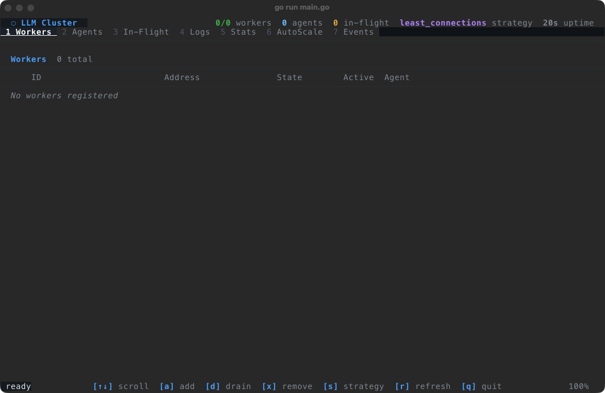
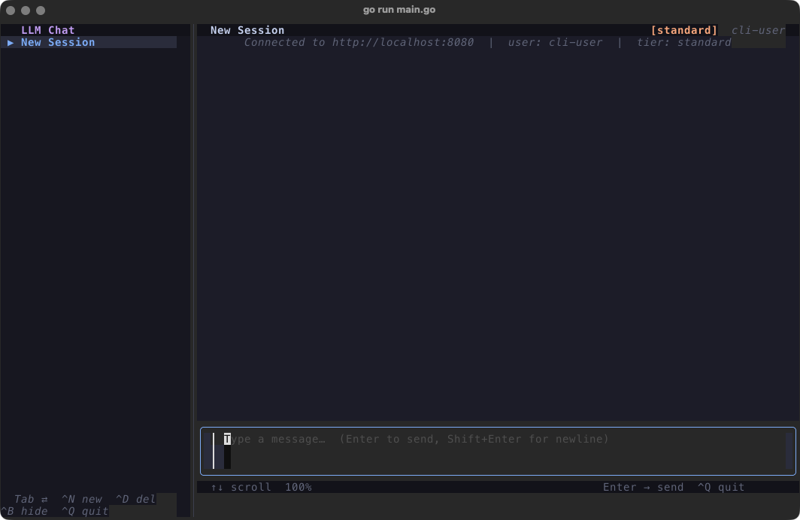

<p align="center">
  <h1 align="center">⚡ LLM Cluster Orchestrator</h1>
  <p align="center">
    Distributed LLM inference system with dynamic load balancing, autoscaling, and fault tolerance.
  </p>
  <p align="center">
    
    
    
    
    
    
  </p>
</p>

<br>

<p align="center">
  
  <br>
  <sub><i>Master Cluster Monitoring TUI — real-time worker status, queue depth, and autoscaling metrics</i></sub>
</p>

<br>

<p align="center">
  
  <br>
  <sub><i>Client Chat TUI — interactive prompt interface with streaming responses</i></sub>
</p>

<br>

## Architecture & Stack

Master-Agent-Worker architecture with a gRPC communication layer:

- **Master & Load Balancer (Go)** — Single source of truth. Maintains worker registries, monitors queue depths, routes requests via gRPC (least-connections / round-robin), autoscales workers dynamically. Built-in TUI for cluster monitoring.
- **Agent (Go)** — Deployed per node. Manages Dockerized worker containers (spawn/kill), monitors CPU/RAM, ensures local services (Ollama, ChromaDB) are running.
- **Worker (Python)** — Stateless gRPC server in Docker. Sentence-Transformers for embeddings, ChromaDB for RAG context retrieval, Ollama for local LLM inference (default: `smollm:135m`).
- **Vector Database (ChromaDB)** — Docker container providing read-only access to embedded document chunks for RAG.
- **LLM Inference (Ollama)** — Local LLM runner for fast, private inference.

## Prerequisites

- **Go 1.20+** — [Install](https://go.dev/doc/install)
- **Python 3.10+** — [Install](https://www.python.org/downloads/)
- **Docker & Docker Compose** — [Install](https://docs.docker.com/get-docker/)
- **Ollama** — [Install](https://ollama.com/download)

## Quick Start

### 1. One-time Setup

```bash
# Build the worker Docker image
docker build -t llm-worker:latest ./worker

# Pre-pull the default Ollama model
ollama pull smollm:135m
```

### 2. Start the Master

```bash
cd master
go run .                   # Listens on http://127.0.0.1:8080
```

### 3. Start the Agent

```bash
cd agent
go run . --master-url http://127.0.0.1:8080
```

The agent automatically starts Ollama, launches ChromaDB via docker-compose, registers with the master, and spawns an initial worker.

### 4. Test the System

```bash
curl -X POST http://127.0.0.1:8080/chat \
  -H "Content-Type: application/json" \
  -d '{"userId":"u1","prompt":"What is the battle of stalingrad?","tier":"free"}'
```

## Advanced Usage

### Multi-Node Deployment

Launch agents on different machines pointing to the master:

```bash
cd agent
go run . --master-url http://<MASTER_IP>:8080
```

For local multi-agent simulation on Linux: `scripts/run-linux.sh`

### Load Testing

- **Simple 1000-request load:** `./scripts/stress_test.sh`
- **Gradual stress test (phased bursts):** `./scripts/gradual_stress_test.sh`
- **Configurable sweep with JSON output:** `./scripts/run_load_sweep.sh results/run1`
- **Go Client Loadtest:** `go run ./client/loadtest/main.go -master-url http://localhost:8080 -user-id load-1`

## Troubleshooting

| Issue | Check |
|-------|-------|
| Chroma build fails | `docker info` — Docker daemon must be running |
| Connection refused on chat | `curl http://127.0.0.1:11434/api/tags` — Ollama must be running |
| Model not found | `ollama pull smollm:135m` — pull the model first |
| Worker fails to register | Check Master TUI logs or Agent logs |

## Components

| Component | Language | Path |
|-----------|----------|------|
| Master | Go | `master/` |
| Agent | Go | `agent/` |
| Worker | Python | `worker/` |
| Client | Go | `client/` |
| Protobuf | Proto3 | `proto/` |
| Vector DB | Docker | `vector-db/` |
